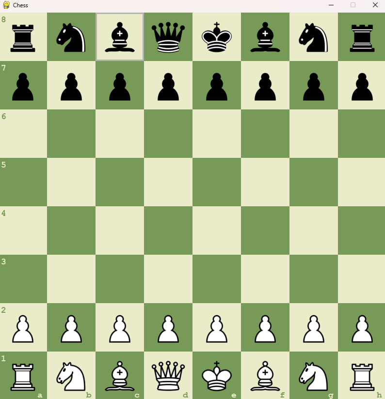
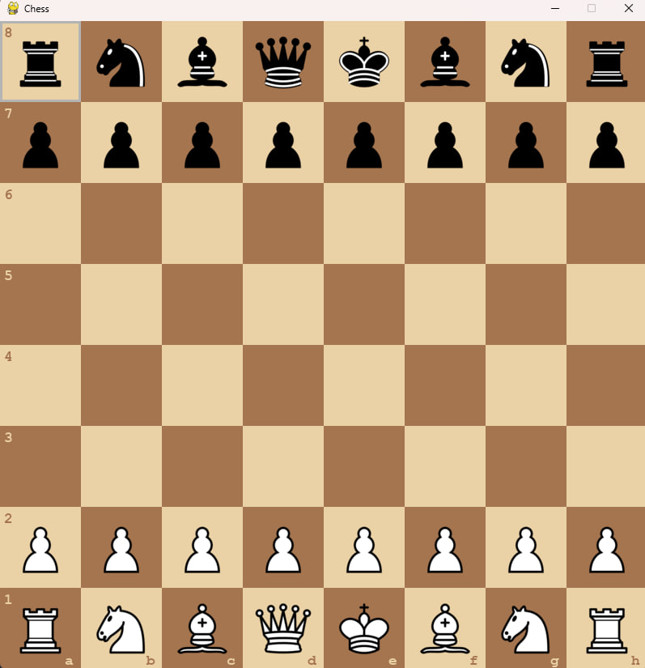
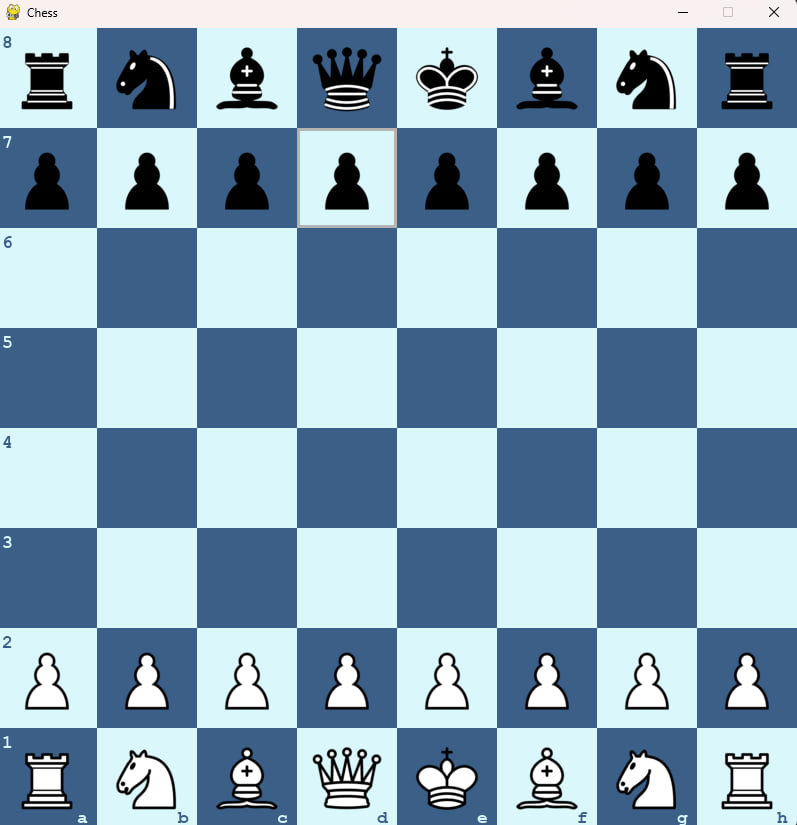
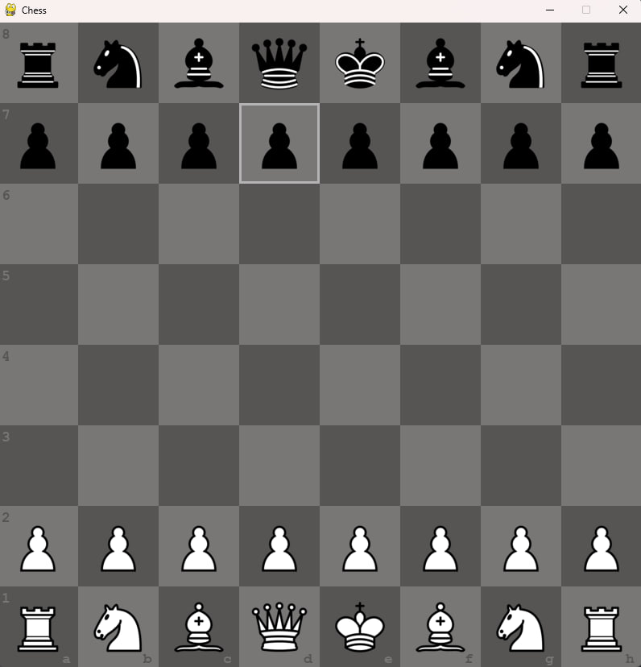
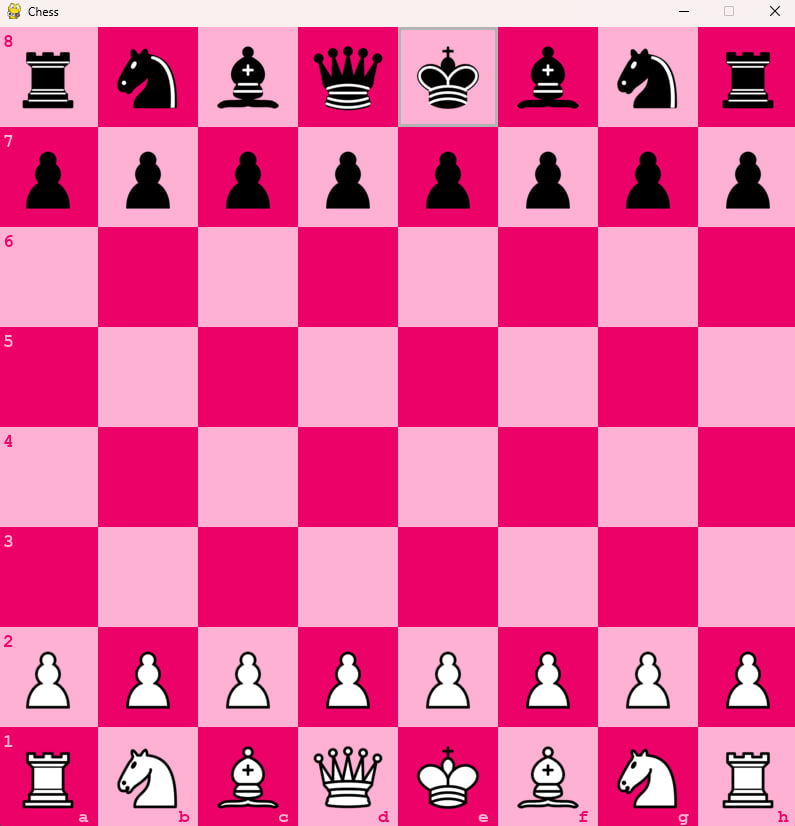

# Chess game in python

* Working on user interface
* 
I made a simple two users chess game in python that has a cheks and castling rules in it, it also has 5 color themes: green (default), brown, blue, gray and pink.

### key shortcuts in game:
- Press 't' to change theme
- Press 'r' to restart the game

## Green 

## Brown

## Blue

## Gray

## Pink

